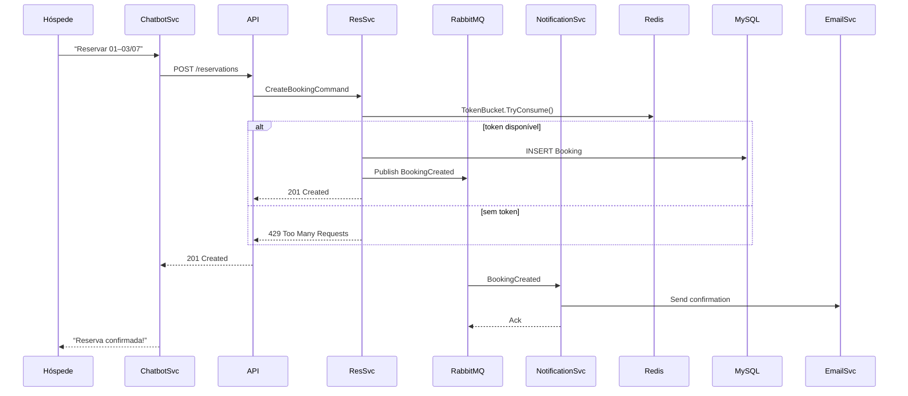
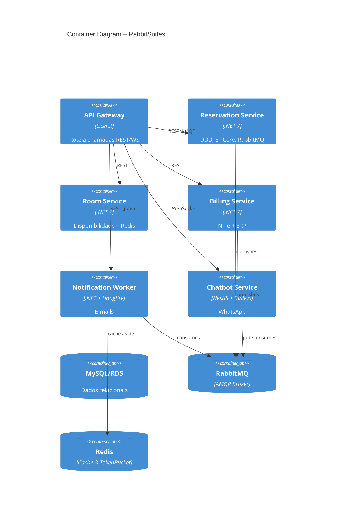

## 3. Especificação Técnica

### 3.1. Resumo
O **RabbitSuites** é uma plataforma multi‐serviço orientada a eventos, construída para orquestrar reservas, faturamento e notificações em hotéis. Cada microserviço segue DDD, expondo APIs REST/AMQP e publicando/consumindo eventos via RabbitMQ; o cache Redis e os mecanismos de resiliência (Token Bucket e Circuit Breaker) garantem performance e disponibilidade.

### 3.2. Componentes Principais do Sistema
1. **API Gateway**  
   - Roteia chamadas REST e WebSocket para os microserviços  
   - Aplica autenticação, autorização e throttling (Token Bucket)  

2. **Reservation Service (.NET 7)**  
   - Domínio “Reserva” (Aggregates, Entities, Domain Events)  
   - Persiste no MySQL via EF Core  
   - Publica `BookingCreated` em RabbitMQ  

3. **Room Service (.NET 7)**  
   - Domínio “Quarto” e “Disponibilidade”  
   - Cache Redis para consultas de disponibilidade  

4. **Billing Service (.NET 7)**  
   - Geração de NF-e e integração SOAP/REST com ERP fiscal  
   - Publica `InvoiceCreated` em RabbitMQ  

5. **Notification Worker (.NET + Hangfire)**  
   - Consome filas de eventos (`BookingCreated`, `InvoiceCreated`)  
   - Envia e-mails de confirmação, NF-e e lembrete de check-out  

6. **Chatbot Service (NestJS + Baileys)**  
   - Interface WhatsApp para reservas e alertas  
   - Publica comandos em RabbitMQ e consulta Redis para estado de diálogo  

7. **Infraestrutura de Mensageria e Cache**  
   - **RabbitMQ**: filas `reservas`, `faturamento`, `notificações`  
   - **Redis**: cache de dados quentes e Token Bucket distribuído  

### 3.3. Requisitos de Software

- **Requisitos Funcionais (RF)**  
  1. Orquestrar criação/consulta de reservas via RabbitMQ.  
  2. Gerar e-mails de NF-e e lembrete de check-out automaticamente.  
  3. Limitar taxa de requisições críticas (Token Bucket).  
  4. Isolar falhas em integrações externas (Circuit Breaker).  
  5. Cache Redis para aceleramento de dashboards.  
  6. Chatbot WhatsApp (Baileys) para reservas e alertas.  
  7. Área administrativa para gestão de quartos, reservas e relatórios.

- **Requisitos Não-Funcionais (RNF)**  
  - .NET 7 e Node.js (NestJS) para serviços.  
  - MySQL ou SQL Server (RDS na AWS).  
  - RabbitMQ como broker AMQP.  
  - Redis para cache distribuído e throttling.  
  - Deploy em Docker/Kubernetes com CI/CD (GitHub Actions).  
  - Conformidade LGPD, TLS 1.2+, criptografia AES-256.

#### 3.3.1. Requisitos Funcionais Detalhados
- **RF-001:** Publicar `BookingCreated` ao criar reserva.  
- **RF-002:** Consumir `BookingCreated` para envio de e-mail de confirmação.  
- **RF-003:** Publicar `InvoiceCreated` ao emitir NF-e.  
- **RF-004:** Consumir `InvoiceCreated` e enviar XML/PDF ao hóspede.  
- **RF-005:** Bloquear requisições acima de X por segundo com Token Bucket.  
- **RF-006:** Abrir Circuit Breaker após N falhas em chamadas ao ERP fiscal.

#### 3.3.2. Requisitos Não-Funcionais Detalhados
- **RNF-001:** Latência máxima de 200 ms em leituras cacheadas.  
- **RNF-002:** 99,9 % de disponibilidade agregada.  
- **RNF-003:** Autoscaling de serviços conforme CPU/memory.  

#### 3.3.3. Fluxo de Criação de Reserva  

### 3.4. Considerações de Design

#### 3.4.1. Visão Inicial  
Organização em microserviços DDD, desacoplados por filas e desacoplados via API Gateway.

#### 3.4.2. Arquitetura em Contêineres  

### 3.5. Stack Tecnológica
- **Back-end:** .NET 7 (C#), Entity Framework Core, Polly (Circuit Breaker)  
- **Chatbot:** NestJS, Baileys  
- **Broker:** RabbitMQ  
- **Cache & Throttle:** Redis  
- **Database:** MySQL ou SQL Server (RDS AWS)  
- **Agendamento:** Hangfire ou cronexpression  
- **CI/CD & Infra:** Docker, Kubernetes, GitHub Actions, AWS, Vercel  

### 3.6. Considerações de Segurança
- **Resiliência:** Circuit Breaker + Retry + Timeout  
- **Rate Limiting:** Token Bucket distribuído  
- **Criptografia:** TLS 1.2+ em trânsito, AES-256 at rest  
- **LGPD:** consentimento, anonimização e logs de auditoria  
