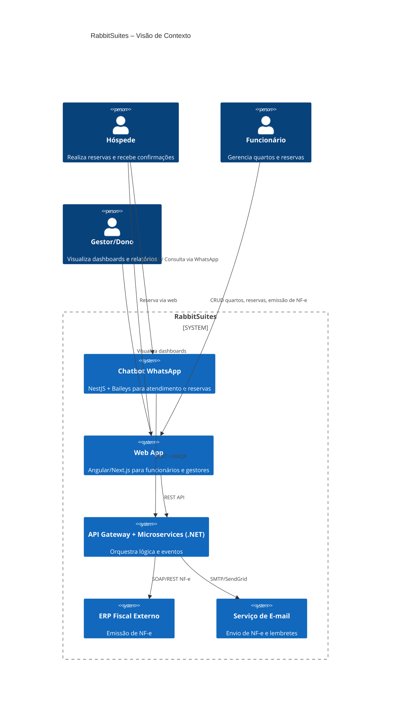
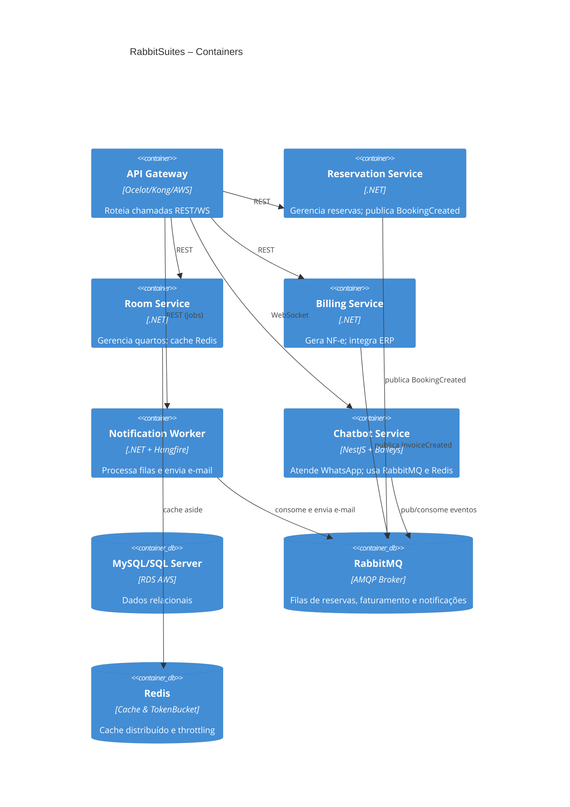
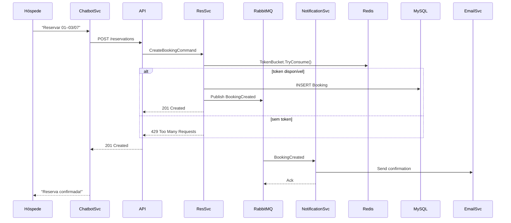
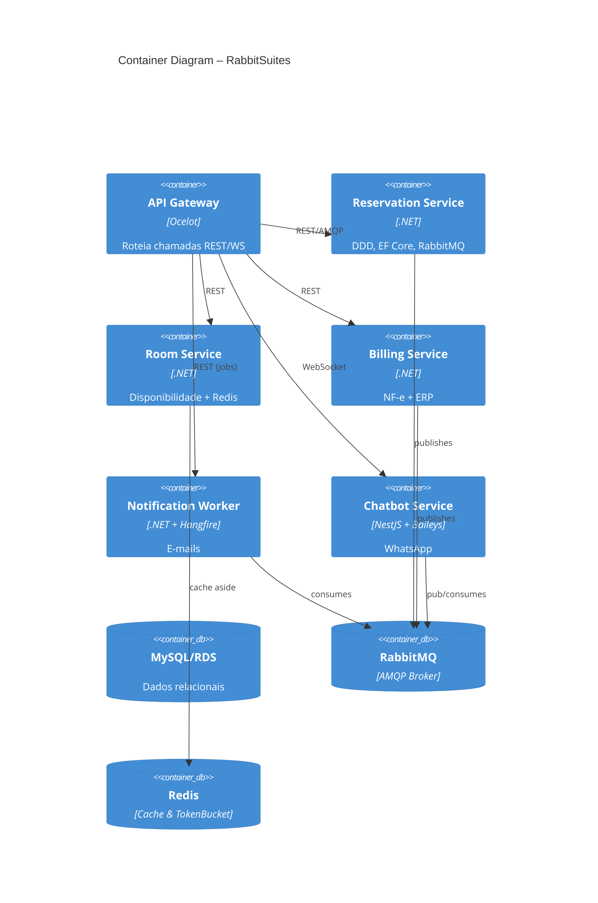

# Capa

- **Título do Projeto**: RabbitSuites – Gestão de Quartos, Reservas e Emissão de NF-e com Chatbot WhatsApp
- **Nome do Estudante**: Gustavo José Rosa
- **Curso**: Engenharia de Software
- **Data de Entrega**: [Data]

# Resumo

Gerenciar quartos, reservas, faturamento e atendimento em canais distintos é um processo fragmentado e sujeito a erros. Equipes hoteleiras perdem tempo sincronizando sistemas, emitindo NF-e manualmente e enviando lembretes, enquanto a satisfação do hóspede cai devido a confirmações tardias e falta de informações centralizadas.

**RabbitSuites** surge para acabar com esse gargalo. Nossa plataforma unificada oferece:

- **Reservas 24/7** via web e WhatsApp (Baileys)
- **Emissão automática de NF-e** com integração direta ao ERP fiscal
- **Notificações inteligentes**: e-mail de NF-e e lembrete de check-out
- **Orquestração segura** com RabbitMQ, Token Bucket e Circuit Breaker
- **Dashboards em tempo real** alimentados por cache Redis
- **Deploy contínuo** (AWS/Vercel) com CI/CD e conformidade à LGPD

Importante ressaltar: o RabbitSuites não é um CRM completo — nosso foco é otimizar a operação hoteleira, eliminando retrabalho e centralizando todo o fluxo de reservas e faturamento em um único painel.

---

## 1. Introdução

No mercado hoteleiro atual, velocidade e consistência são requisitos básicos para fidelizar hóspedes. Ainda assim, muitos estabelecimentos dependem de múltiplas planilhas, sistemas de reserva isolados e processos manuais de emissão fiscal — gerando retrabalho, erros contábeis e experiência fragmentada.

O **RabbitSuites** foi desenhado para resolver esses pontos de dor. A plataforma centraliza em um só lugar:

- Gestão de quartos e reservas com sincronização instantânea
- Chatbot WhatsApp (Baileys) para interação ágil e notificações
- Emissão eletrônica de NF-e automatizada
- Orquestração de mensagens com RabbitMQ e limitação de taxa (Token Bucket)
- Resiliência garantida por Circuit Breaker em serviços externos
- Aceleramento de consultas por meio de Caching Distribuído (Redis)

Com RabbitSuites, você reduz custos operacionais, elimina integrações manuais e entrega uma experiência de ponta a ponta ao hóspede — do check-in ao pós-venda.

## 2. Descrição do Projeto

**RabbitSuites** é uma plataforma unificada, projetada para centralizar e automatizar todo o fluxo hoteleiro — da reserva à emissão de NF-e e pós-venda — em um único painel. Com integração via web e WhatsApp (Baileys), orquestração assíncrona (RabbitMQ), cache Redis e mecanismos de resiliência (Circuit Breaker e Token Bucket), entregamos uma solução robusta e escalável para hotéis que buscam alta disponibilidade e eficiência operacional.

O projeto nasceu para resolver problemas comuns e custosos no dia a dia hoteleiro:

- **Processos fragmentados** entre sistemas de reserva e canais de venda, que geram retrabalho e erros de disponibilidade.
- **Emissão manual de NF-e**, sujeita a falhas e atrasos contábeis.
- **Picos de acesso** que sobrecarregam servidores e afetam a experiência do hóspede.
- **Comunicação ineficiente**, sem lembretes automatizados ou notificações centralizadas.

**RabbitSuites** elimina essas barreiras ao automatizar e orquestrar:

- **Reservas e disponibilidade** em tempo real, sincronizadas via web e WhatsApp.
- **Geração e envio de NF-e** diretamente para o ERP fiscal, com notificação instantânea ao hóspede.
- **Notificações diárias** por e-mail (check-out, confirmação de pagamento, lembretes).
- **Dashboards responsivos** alimentados por cache Redis, para monitoramento imediato.

É importante notar: RabbitSuites não é um sistema de gestão completa de propriedades (PMS) nem um CRM. Nosso foco estratégico é otimizar reservas, faturamento e comunicação automatizada, reduzindo custos operacionais e permitindo que sua equipe se concentre na hospitalidade.

# 3. Especificação Técnica

### 3.1. Resumo

O **RabbitSuites** é uma plataforma multi‐serviço orientada a eventos, construída para orquestrar reservas, faturamento e notificações em hotéis. Cada microserviço segue DDD, expondo APIs REST/AMQP e publicando/consumindo eventos via RabbitMQ; o cache Redis e os mecanismos de resiliência (Token Bucket e Circuit Breaker) garantem performance e disponibilidade.

### 3.2. Componentes Principais do Sistema

1. **API Gateway**

   - Roteia chamadas REST e WebSocket para os microserviços
   - Aplica autenticação, autorização e throttling (Token Bucket)

2. **Reservation Service (.NET)**

   - Domínio “Reserva” (Aggregates, Entities, Domain Events)
   - Persiste no MySQL via EF Core
   - Publica `BookingCreated` em RabbitMQ

3. **Room Service (.NET)**

   - Domínio “Quarto” e “Disponibilidade”
   - Cache Redis para consultas de disponibilidade

4. **Billing Service (.NET)**

   - Geração de NF-e e integração SOAP/REST com ERP fiscal
   - Publica `InvoiceCreated` em RabbitMQ

5. **Notification Worker (.NET + Hangfire)**

   - Consome filas de eventos (`BookingCreated`, `InvoiceCreated`)
   - Envia e-mails de confirmação, NF-e e lembrete de check-out

6. **Chatbot Service (NestJS + Baileys)**

   - Interface WhatsApp para reservas e alertas
   - Publica comandos em RabbitMQ e consulta Redis para estado de diálogo

7. **Infraestrutura de Mensageria e Cache**
   - **RabbitMQ**: filas `reservas`, `faturamento`, `notificações`
   - **Redis**: cache de dados quentes e Token Bucket distribuído

### 3.3. Requisitos de Software

- **Requisitos Funcionais (RF)**

  1. Orquestrar criação/consulta de reservas via RabbitMQ.
  2. Gerar e-mails de NF-e e lembrete de check-out automaticamente.
  3. Limitar taxa de requisições críticas (Token Bucket).
  4. Isolar falhas em integrações externas (Circuit Breaker).
  5. Cache Redis para aceleramento de dashboards.
  6. Chatbot WhatsApp (Baileys) para reservas e alertas.
  7. Área administrativa para gestão de quartos, reservas e relatórios.

- **Requisitos Não-Funcionais (RNF)**
  - .NET e Node.js (NestJS) para serviços.
  - MySQL ou SQL Server (RDS na AWS).
  - RabbitMQ como broker AMQP.
  - Redis para cache distribuído e throttling.
  - Deploy em Docker/Kubernetes com CI/CD (GitHub Actions).
  - Conformidade LGPD, TLS 1.2+, criptografia AES-256.

### 3.4. Considerações de Design

- Organização em microserviços DDD, desacoplados por filas e geridos via API Gateway.

### 3.5. Stack Tecnológica

- **Back-end:** .NET (C#), EF Core, Polly (Circuit Breaker)
- **Chatbot:** NestJS + Baileys
- **Broker:** RabbitMQ
- **Cache & Throttle:** Redis
- **Database:** MySQL/SQL Server
- **Agendamento:** Hangfire ou cronexpression
- **Infra & CI/CD:** Docker, Kubernetes, GitHub Actions, AWS, Vercel

### 3.6. Considerações de Segurança

- Circuit Breaker + Retry + Timeout
- Token Bucket distribuído
- TLS 1.2+ e AES-256
- Compliance LGPD

---

## 3.7. Modelos C4

### 3.7.1. Diagrama de Contexto (C4 Nível 1)



### 3.7.2. Diagrama de Contêineres (C4 Nível 2)



### 3.7.3. Diagrama de Componentes (C4 Nível 3) – Reservation Service

```mermaid
C4Component
    title Reservation Service – Componentes Internos
    Container(reservationSvc, "Reservation Service", ".NET", "")
    Component(domain, "Domain Layer", "", "Entidades, ValueObjects, DomainServices, Eventos")
    Component(app, "Application Layer", "", "UseCases, Commands/Queries, DTOs, Interfaces")
    Component(infra, "Infrastructure Layer", "", "EF Core, RabbitMQ Publishers, Redis Client, TokenBucket")
    Component(api, "API Layer", "", "Controllers, Middlewares (CB, TB), DI")
    Rel(api, app, "Invoca UseCases")
    Rel(app, domain, "Aplica regras de negócio")
    Rel(app, infra, "Chama repositórios e publica eventos")
    Rel(infra, rabbit, "RabbitMQ Publisher")
    Rel(infra, redis, "TokenBucket + Cache")
```

### 3.1. Resumo

O **RabbitSuites** é uma plataforma multi‐serviço orientada a eventos, construída para orquestrar reservas, faturamento e notificações em hotéis. Cada microserviço segue DDD, expondo APIs REST/AMQP e publicando/consumindo eventos via RabbitMQ; o cache Redis e os mecanismos de resiliência (Token Bucket e Circuit Breaker) garantem performance e disponibilidade.

### 3.2. Componentes Principais do Sistema

1. **API Gateway**

   - Roteia chamadas REST e WebSocket para os microserviços
   - Aplica autenticação, autorização e throttling (Token Bucket)

2. **Reservation Service (.NET)**

   - Domínio “Reserva” (Aggregates, Entities, Domain Events)
   - Persiste no MySQL via EF Core
   - Publica `BookingCreated` em RabbitMQ

3. **Room Service (.NET)**

   - Domínio “Quarto” e “Disponibilidade”
   - Cache Redis para consultas de disponibilidade

4. **Billing Service (.NET)**

   - Geração de NF-e e integração SOAP/REST com ERP fiscal
   - Publica `InvoiceCreated` em RabbitMQ

5. **Notification Worker (.NET + Hangfire)**

   - Consome filas de eventos (`BookingCreated`, `InvoiceCreated`)
   - Envia e-mails de confirmação, NF-e e lembrete de check-out

6. **Chatbot Service (NestJS + Baileys)**

   - Interface WhatsApp para reservas e alertas
   - Publica comandos em RabbitMQ e consulta Redis para estado de diálogo

7. **Infraestrutura de Mensageria e Cache**
   - **RabbitMQ**: filas `reservas`, `faturamento`, `notificações`
   - **Redis**: cache de dados quentes e Token Bucket distribuído

### 3.3. Requisitos de Software

- **Requisitos Funcionais (RF)**

  1. Orquestrar criação/consulta de reservas via RabbitMQ.
  2. Gerar e-mails de NF-e e lembrete de check-out automaticamente.
  3. Limitar taxa de requisições críticas (Token Bucket).
  4. Isolar falhas em integrações externas (Circuit Breaker).
  5. Cache Redis para aceleramento de dashboards.
  6. Chatbot WhatsApp (Baileys) para reservas e alertas.
  7. Área administrativa para gestão de quartos, reservas e relatórios.

- **Requisitos Não-Funcionais (RNF)**
  - .NET e Node.js (NestJS) para serviços.
  - MySQL ou SQL Server (RDS na AWS).
  - RabbitMQ como broker AMQP.
  - Redis para cache distribuído e throttling.
  - Deploy em Docker/Kubernetes com CI/CD (GitHub Actions).
  - Conformidade LGPD, TLS 1.2+, criptografia AES-256.

#### 3.3.1. Requisitos Funcionais Detalhados

- **RF-001:** Publicar `BookingCreated` ao criar reserva.
- **RF-002:** Consumir `BookingCreated` para envio de e-mail de confirmação.
- **RF-003:** Publicar `InvoiceCreated` ao emitir NF-e.
- **RF-004:** Consumir `InvoiceCreated` e enviar XML/PDF ao hóspede.
- **RF-005:** Bloquear requisições acima de X por segundo com Token Bucket.
- **RF-006:** Abrir Circuit Breaker após N falhas em chamadas ao ERP fiscal.

#### 3.3.2. Requisitos Não-Funcionais Detalhados

- **RNF-001:** Latência máxima de 200 ms em leituras cacheadas.
- **RNF-002:** 99,9 % de disponibilidade agregada.
- **RNF-003:** Autoscaling de serviços conforme CPU/memory.

#### 3.3.3. Fluxo de Criação de Reserva



### 3.4. Considerações de Design

#### 3.4.1. Visão Inicial

Organização em microserviços DDD, desacoplados por filas e desacoplados via API Gateway.

#### 3.4.2. Arquitetura em Contêineres



### 3.5. Stack Tecnológica

- **Back-end:** .NET (C#), Entity Framework Core, Polly (Circuit Breaker)
- **Chatbot:** NestJS, Baileys
- **Broker:** RabbitMQ
- **Cache & Throttle:** Redis
- **Database:** MySQL ou SQL Server (RDS AWS)
- **Agendamento:** Hangfire ou cronexpression
- **CI/CD & Infra:** Docker, Kubernetes, GitHub Actions, AWS, Vercel

### 3.6. Considerações de Segurança

- **Resiliência:** Circuit Breaker + Retry + Timeout
- **Rate Limiting:** Token Bucket distribuído
- **Criptografia:** TLS 1.2+ em trânsito, AES-256 at rest
- **LGPD:** consentimento, anonimização e logs de auditoria

## 4. Próximos Passos

1. Provisionar **Redis** e **RabbitMQ** em ambiente de dev.
2. Implementar middleware de **Token Bucket** e **Circuit Breaker** na API.
3. Criar workers para processamento de filas e jobs agendados (Hangfire).
4. Configurar **caching** de consultas críticas no Redis.
5. Ajustar pipeline CI/CD para testes de resiliência (caixas d’água) e performance de cache.
6. Realizar testes de carga simulando falhas externas e picos de reservas.
7. Documentar diagramas C4 e sequência de fallback do Circuit Breaker.

## 5. Referências

- RabbitMQ Documentation
- Polly Circuit Breaker Patterns
- Redis Caching Strategies
- Baileys WhatsApp Web API Guide
- LGPD: Lei Geral de Proteção de Dados

## 6. Apêndices (Opcionais)

- Diagrama UML de sequência para fluxo de reservas em RabbitMQ e fallback de Circuit Breaker.
- Exemplo de C4 Container Diagram detalhado.

## 7. Avaliações de Professores

- **Considerações Professor/a:**
- **Considerações Professor/a:**
- **Considerações Professor/a:**
