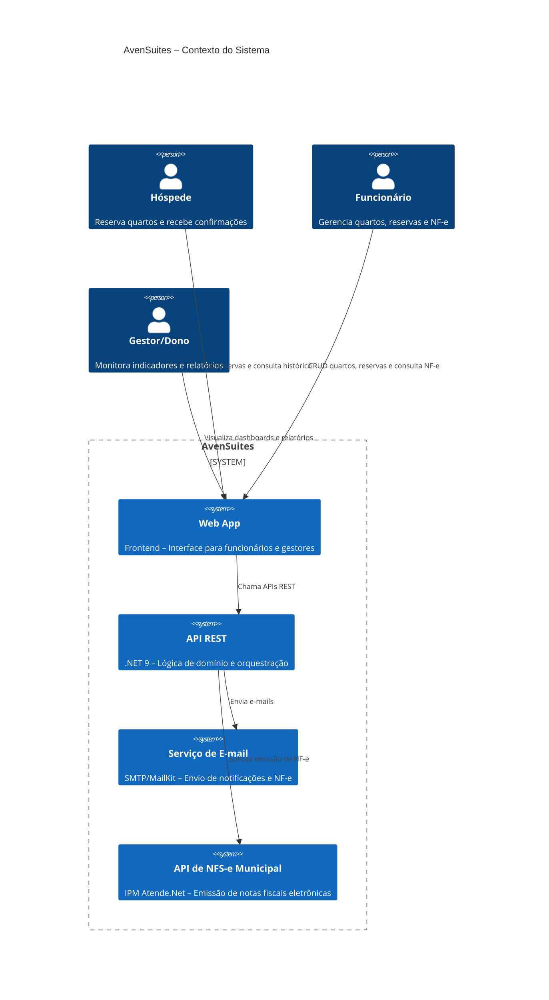
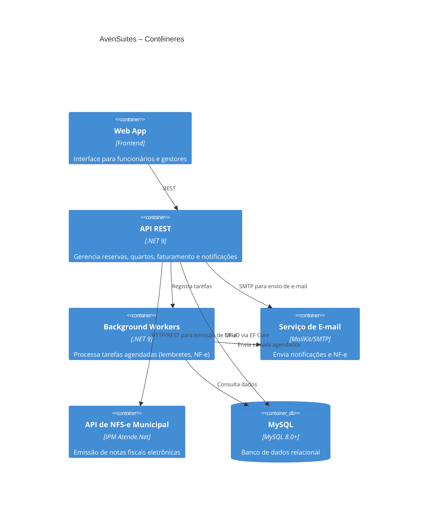
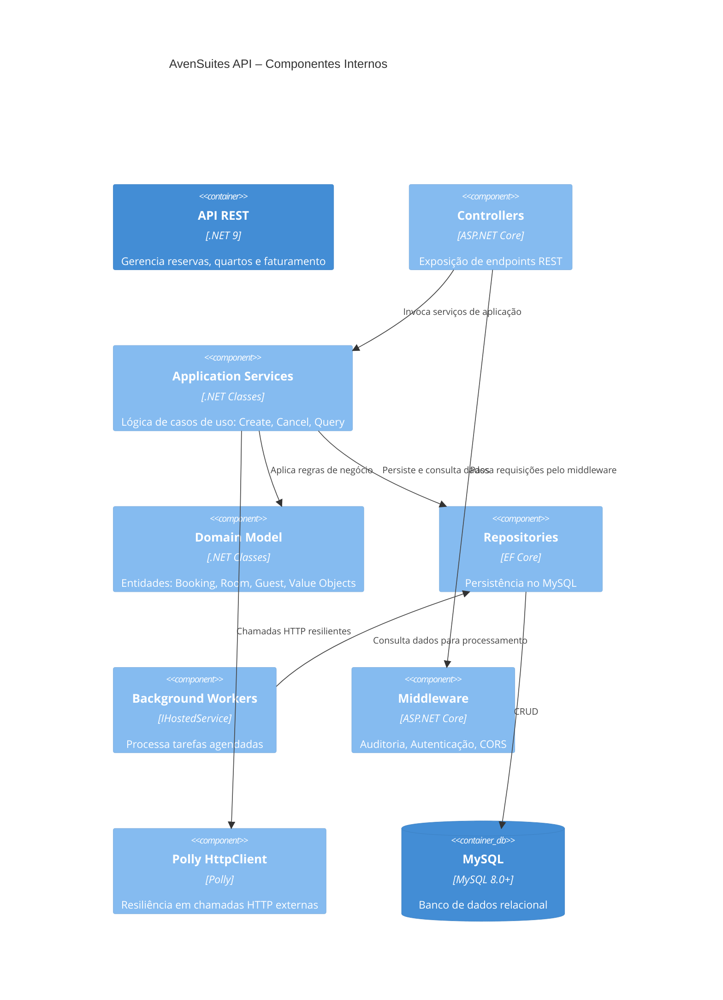

# Capa

- **Título do Projeto**: AvenSuites – Gestão de Quartos, Reservas e Emissão de NF-e
- **Nome do Estudante**: Gustavo José Rosa
- **Curso**: Engenharia de Software
- **Data de Entrega**: [Data]

# Resumo

Gerenciar quartos, reservas, faturamento e atendimento em canais distintos é um processo fragmentado e sujeito a erros. Equipes hoteleiras perdem tempo sincronizando sistemas, emitindo NF-e manualmente e enviando lembretes, enquanto a satisfação do hóspede cai devido a confirmações tardias e falta de informações centralizadas.

**AvenSuites** surge para acabar com esse gargalo. Nossa plataforma unificada oferece:

- **Reservas 24/7** via API RESTful
- **Emissão automática de NF-e** com integração direta ao ERP fiscal (IPM Atende.Net)
- **Notificações inteligentes**: e-mail de confirmação, NF-e e lembretes de check-in/check-out
- **Processamento assíncrono** com Background Workers para tarefas agendadas
- **Resiliência HTTP** com Polly para chamadas externas
- **Conformidade LGPD** com criptografia AES-256 para dados sensíveis
- **Deploy contínuo** com CI/CD e testes automatizados (80%+ de cobertura)

Importante ressaltar: o AvenSuites não é um CRM completo — nosso foco é otimizar a operação hoteleira, eliminando retrabalho e centralizando todo o fluxo de reservas e faturamento em um único painel.

---

## 1. Introdução

No mercado hoteleiro atual, velocidade e consistência são requisitos básicos para fidelizar hóspedes. Ainda assim, muitos estabelecimentos dependem de múltiplas planilhas, sistemas de reserva isolados e processos manuais de emissão fiscal — gerando retrabalho, erros contábeis e experiência fragmentada.

O **AvenSuites** foi desenhado para resolver esses pontos de dor. A plataforma centraliza em um só lugar:

- Gestão de quartos e reservas com sincronização instantânea
- Emissão eletrônica de NF-e automatizada via integração com IPM Atende.Net
- Notificações automáticas por e-mail (confirmação, lembretes, NF-e)
- Processamento assíncrono com Background Workers para tarefas agendadas
- Resiliência garantida por Polly em chamadas HTTP externas
- Conformidade LGPD com criptografia de dados sensíveis

Com AvenSuites, você reduz custos operacionais, elimina integrações manuais e entrega uma experiência de ponta a ponta ao hóspede — do check-in ao pós-venda.

## 2. Descrição do Projeto

**AvenSuites** é uma plataforma unificada, projetada para centralizar e automatizar todo o fluxo hoteleiro — da reserva à emissão de NF-e e pós-venda — em um único painel. Com arquitetura monolítica modular seguindo Clean Architecture e DDD, processamento assíncrono via Background Workers, e mecanismos de resiliência (Polly), entregamos uma solução robusta e escalável para hotéis que buscam alta disponibilidade e eficiência operacional.

O projeto nasceu para resolver problemas comuns e custosos no dia a dia hoteleiro:

- **Processos fragmentados** entre sistemas de reserva e canais de venda, que geram retrabalho e erros de disponibilidade.
- **Emissão manual de NF-e**, sujeita a falhas e atrasos contábeis.
- **Falta de automação** em notificações e lembretes para hóspedes.
- **Comunicação ineficiente**, sem lembretes automatizados ou notificações centralizadas.

**AvenSuites** elimina essas barreiras ao automatizar e orquestrar:

- **Reservas e disponibilidade** em tempo real, sincronizadas via API RESTful.
- **Geração e envio de NF-e** diretamente para o ERP fiscal (IPM Atende.Net), com notificação instantânea ao hóspede.
- **Notificações automáticas** por e-mail (check-out, confirmação de pagamento, lembretes de check-in).
- **Processamento assíncrono** de tarefas pesadas via Background Workers.

É importante notar: AvenSuites não é um sistema de gestão completa de propriedades (PMS) nem um CRM. Nosso foco estratégico é otimizar reservas, faturamento e comunicação automatizada, reduzindo custos operacionais e permitindo que sua equipe se concentre na hospitalidade.

# 3. Especificação Técnica

### 3.1. Resumo

O **AvenSuites** é uma plataforma monolítica modular orientada a eventos, construída para orquestrar reservas, faturamento e notificações em hotéis. A arquitetura segue Clean Architecture e DDD, expondo APIs REST e processando eventos via Background Workers; a resiliência HTTP (Polly) e os mecanismos de processamento assíncrono garantem performance e disponibilidade.

### 3.2. Componentes Principais do Sistema

1. **API REST (.NET 9)**

   - Expõe endpoints RESTful para todas as operações
   - Aplica autenticação JWT Bearer e autorização baseada em roles
   - Middleware de auditoria para rastreamento de ações

2. **Reservation Service (Domain/Application)**

   - Domínio "Reserva" (Aggregates, Entities, Domain Events)
   - Persiste no MySQL via EF Core
   - Publica eventos para processamento assíncrono

3. **Room Service (Domain/Application)**

   - Domínio "Quarto" e "Disponibilidade"
   - Controle de disponibilidade dia a dia via BookingRoomNight

4. **Billing Service (Domain/Application)**

   - Geração de NF-e e integração HTTP com ERP fiscal (IPM Atende.Net)
   - Resiliência HTTP com Polly para chamadas externas
   - Publica eventos `InvoiceCreated` para notificações

5. **Notification Workers (.NET Background Services)**

   - **BookingReminderWorker**: Envia lembretes 3 dias antes do check-in
   - **CheckOutReminderWorker**: Envia lembretes 1 dia antes do check-out
   - **InvoiceBackgroundWorker**: Processa emissão de NF-e em background
   - **IntegrationEventPublisher**: Publica eventos de integração (preparado para RabbitMQ futuro)

6. **Email Service**

   - Envio de e-mails via SMTP (MailKit)
   - Templates HTML responsivos para todos os tipos de notificação
   - Suporte a CC, BCC e múltiplos destinatários

7. **Infraestrutura de Dados**
   - **MySQL 8.0+**: Banco de dados relacional principal
   - **Entity Framework Core**: ORM com migrations automáticas
   - **Outbox Pattern**: Tabelas IntegrationEventOutbox/Inbox para eventos futuros

### 3.3. Requisitos de Software

### Módulo de Reserva
- **RF-RES-001**: Criar uma nova reserva via API REST.  
- **RF-RES-002**: Consultar disponibilidade de quartos em tempo real.  
- **RF-RES-003**: Listar reservas existentes por hóspede, data ou status.  
- **RF-RES-004**: Atualizar/cancelar reserva, com atualização de disponibilidade.  
- **RF-RES-005**: Calcular preços automaticamente baseado em ocupação (1, 2, 3+ hóspedes).

### Módulo de Quarto
- **RF-ROOM-001**: Cadastrar e editar informações de quartos (número, tipo, tarifa).  
- **RF-ROOM-002**: Marcar quarto como "manutenção" ou "indisponível".  
- **RF-ROOM-003**: Consultar status de ocupação e histórico de ocupações.  
- **RF-ROOM-004**: Sistema de preços por ocupação (RoomTypeOccupancyPrice).

### Módulo de Faturamento (Billing)
- **RF-BIL-001**: Gerar Nota Fiscal Eletrônica (NF-e) a partir de reserva confirmada.  
- **RF-BIL-002**: Integrar via HTTP com ERP fiscal (IPM Atende.Net) para validação e protocolo de NF-e.  
- **RF-BIL-003**: Permitir consulta de XML/PDF da NF-e pelo painel administrativo.  
- **RF-BIL-004**: Processar emissão de NF-e em background via InvoiceBackgroundWorker.

### Módulo de Notificações
- **RF-NOT-001**: Enviar e-mail de confirmação de reserva automaticamente.  
- **RF-NOT-002**: Enviar e-mail com NF-e ao hóspede após emissão.  
- **RF-NOT-003**: Agendar lembretes automáticos de check-in (3 dias antes) e check-out (1 dia antes).  
- **RF-NOT-004**: Templates HTML responsivos para todos os tipos de e-mail.

### Módulo de Hóspedes
- **RF-GST-001**: CRUD completo de hóspedes com dados criptografados (LGPD).
- **RF-GST-002**: Portal do hóspede para consulta de reservas próprias.
- **RF-GST-003**: Registro de hóspedes com criação automática de usuário e role Guest.

### Módulo Administrativo (API)
- **RF-ADM-001**: Autenticação JWT Bearer com roles (Admin, Hotel-Admin, User, Guest).  
- **RF-ADM-002**: Endpoints para consulta de KPIs (ocupação, receita, reservas por período).  
- **RF-ADM-003**: CRUD completo de hóspedes, funcionários e configurações de hotel.  
- **RF-ADM-004**: Filtros avançados (data, status, tipo de quarto) em listas de reservas e faturas.  
- **RF-ADM-005**: Sistema de auditoria com log de todas as ações importantes.

### 3.4. Considerações de Design

- **Clean Architecture**: Separação em camadas (Domain, Application, Infrastructure, Presentation)
- **Domain-Driven Design (DDD)**: Entidades, Value Objects, Aggregates, Domain Events
- **Repository Pattern**: Abstração de acesso a dados
- **Outbox Pattern**: Preparado para integração futura com mensageria (RabbitMQ)
- **Background Workers**: Processamento assíncrono de tarefas agendadas
- **Resiliência HTTP**: Polly para retry e circuit breaker em chamadas externas

### 3.5. Stack Tecnológica

- **Back-end:** .NET 9, ASP.NET Core Web API, EF Core 9.0.9
- **Database:** MySQL 8.0+ (Pomelo.EntityFrameworkCore.MySql 9.0.0)
- **Autenticação:** JWT Bearer Authentication
- **Segurança:** Argon2 (hash de senhas), AES-256 (criptografia de dados sensíveis)
- **E-mail:** MailKit 4.14.1 (SMTP)
- **Resiliência:** Microsoft.Extensions.Http.Polly 9.0.10
- **Documentação:** Swagger/OpenAPI
- **Testes:** xUnit, FluentAssertions, Moq (80%+ de cobertura)
- **Agendamento:** Background Workers (IHostedService)
- **Integração Fiscal:** IPM Atende.Net (HTTP/REST)
- **Infra & CI/CD:** Docker (preparado), GitHub Actions (preparado)

### 3.6. Considerações de Segurança

- **Autenticação JWT**: Tokens com expiração configurável
- **Autorização por Roles**: Controle de acesso granular (Admin, Hotel-Admin, User, Guest)
- **Hash de Senhas**: Argon2 (resistente a ataques de força bruta)
- **Criptografia de Dados**: AES-256 para dados sensíveis (CPF, RG) - LGPD compliance
- **Resiliência HTTP**: Polly com retry e circuit breaker
- **Auditoria**: Middleware de auditoria para rastreamento de ações
- **TLS 1.2+**: HTTPS obrigatório em produção
- **CORS**: Configuração restritiva para frontend

---

## 3.7. Modelos C4

### 3.7.1. Diagrama de Contexto (C4 Nível 1)

### 3.7.2. Diagrama de Contêineres (C4 Nível 2)

### 3.7.3. Diagrama de Componentes (C4 Nível 3) – API Principal

## 4. Próximos Passos

## 5. Referências

- [The C4 Model for Software Architecture](https://c4model.com)  
- [.NET 9 Documentation](https://learn.microsoft.com/pt-br/dotnet/)  
- [Entity Framework Core Documentation](https://learn.microsoft.com/pt-br/ef/core/)  
- [Clean Architecture](https://blog.cleancoder.com/uncle-bob/2012/08/13/the-clean-architecture.html)
- [Domain-Driven Design](https://www.domainlanguage.com/ddd/)
- [Polly (Resilience for .NET)](https://github.com/App-vNext/Polly)  
- [MailKit Documentation](https://github.com/jstedfast/MailKit)
- [IPM Atende.Net – NFS-e API (São Francisco do Sul)](https://nfse-saofranciscodosul.atende.net/)  
- [LGPD – Lei Geral de Proteção de Dados (Brasil)](https://www.planalto.gov.br/ccivil_03/_ato2015-2018/2018/lei/L13709.htm)  
- [Argon2 Password Hashing](https://github.com/kmaragon/Isopoh.Cryptography.Argon2)
- [xUnit Testing Framework](https://xunit.net/)

## 6. Avaliações de Professores

- **Considerações Professor/a:**
- **Considerações Professor/a:**
- **Considerações Professor/a:**

