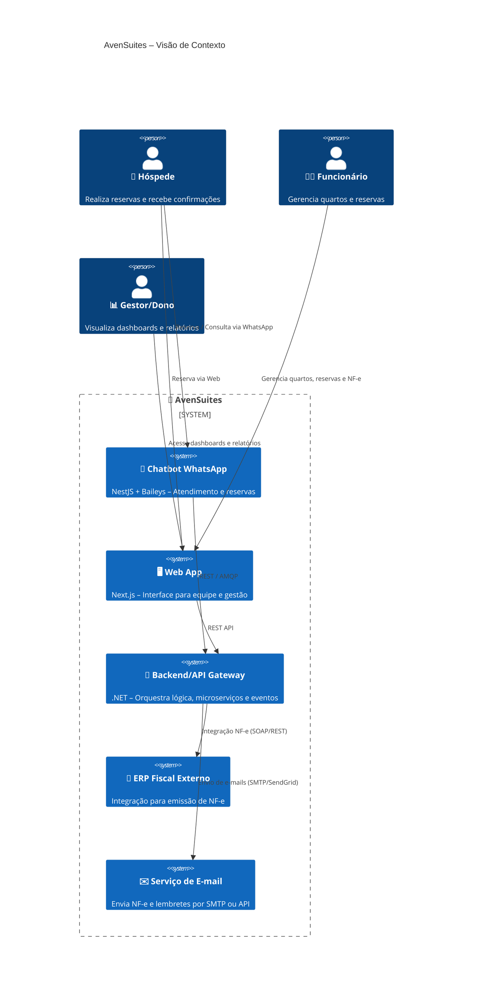
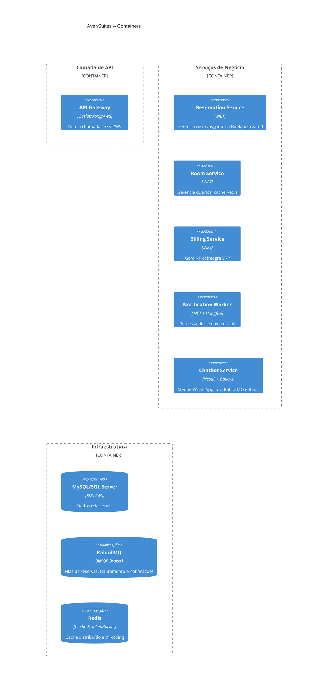
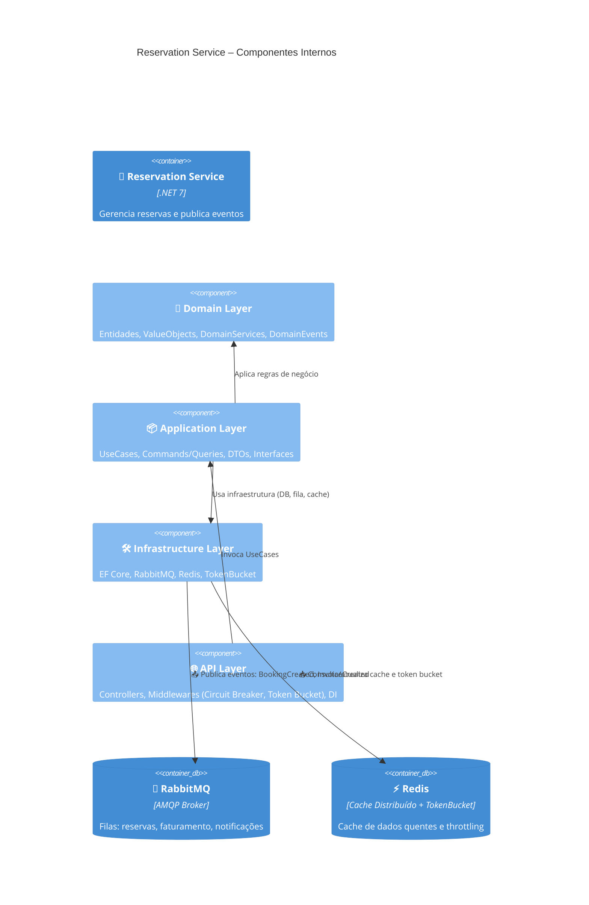

# Capa

- **Título do Projeto**: AvenSuites – Gestão de Quartos, Reservas e Emissão de NF-e com Chatbot WhatsApp
- **Nome do Estudante**: Gustavo José Rosa
- **Curso**: Engenharia de Software
- **Data de Entrega**: [Data]

# Resumo

Gerenciar quartos, reservas, faturamento e atendimento em canais distintos é um processo fragmentado e sujeito a erros. Equipes hoteleiras perdem tempo sincronizando sistemas, emitindo NF-e manualmente e enviando lembretes, enquanto a satisfação do hóspede cai devido a confirmações tardias e falta de informações centralizadas.

**AvenSuites** surge para acabar com esse gargalo. Nossa plataforma unificada oferece:

- **Reservas 24/7** via web e WhatsApp (Baileys)
- **Emissão automática de NF-e** com integração direta ao ERP fiscal
- **Notificações inteligentes**: e-mail de NF-e e lembrete de check-out
- **Orquestração segura** com RabbitMQ, Token Bucket e Circuit Breaker
- **Dashboards em tempo real** alimentados por cache Redis
- **Deploy contínuo** (AWS/Vercel) com CI/CD e conformidade à LGPD

Importante ressaltar: o AvenSuites não é um CRM completo — nosso foco é otimizar a operação hoteleira, eliminando retrabalho e centralizando todo o fluxo de reservas e faturamento em um único painel.

---

## 1. Introdução

No mercado hoteleiro atual, velocidade e consistência são requisitos básicos para fidelizar hóspedes. Ainda assim, muitos estabelecimentos dependem de múltiplas planilhas, sistemas de reserva isolados e processos manuais de emissão fiscal — gerando retrabalho, erros contábeis e experiência fragmentada.

O **AvenSuites** foi desenhado para resolver esses pontos de dor. A plataforma centraliza em um só lugar:

- Gestão de quartos e reservas com sincronização instantânea
- Chatbot WhatsApp (Baileys) para interação ágil e notificações
- Emissão eletrônica de NF-e automatizada
- Orquestração de mensagens com RabbitMQ e limitação de taxa (Token Bucket)
- Resiliência garantida por Circuit Breaker em serviços externos
- Aceleramento de consultas por meio de Caching Distribuído (Redis)

Com AvenSuites, você reduz custos operacionais, elimina integrações manuais e entrega uma experiência de ponta a ponta ao hóspede — do check-in ao pós-venda.

## 2. Descrição do Projeto

**AvenSuites** é uma plataforma unificada, projetada para centralizar e automatizar todo o fluxo hoteleiro — da reserva à emissão de NF-e e pós-venda — em um único painel. Com integração via web e WhatsApp (Baileys), orquestração assíncrona (RabbitMQ), cache Redis e mecanismos de resiliência (Circuit Breaker e Token Bucket), entregamos uma solução robusta e escalável para hotéis que buscam alta disponibilidade e eficiência operacional.

O projeto nasceu para resolver problemas comuns e custosos no dia a dia hoteleiro:

- **Processos fragmentados** entre sistemas de reserva e canais de venda, que geram retrabalho e erros de disponibilidade.
- **Emissão manual de NF-e**, sujeita a falhas e atrasos contábeis.
- **Picos de acesso** que sobrecarregam servidores e afetam a experiência do hóspede.
- **Comunicação ineficiente**, sem lembretes automatizados ou notificações centralizadas.

**AvenSuites** elimina essas barreiras ao automatizar e orquestrar:

- **Reservas e disponibilidade** em tempo real, sincronizadas via web e WhatsApp.
- **Geração e envio de NF-e** diretamente para o ERP fiscal, com notificação instantânea ao hóspede.
- **Notificações diárias** por e-mail (check-out, confirmação de pagamento, lembretes).
- **Dashboards responsivos** alimentados por cache Redis, para monitoramento imediato.

É importante notar: AvenSuites não é um sistema de gestão completa de propriedades (PMS) nem um CRM. Nosso foco estratégico é otimizar reservas, faturamento e comunicação automatizada, reduzindo custos operacionais e permitindo que sua equipe se concentre na hospitalidade.

# 3. Especificação Técnica

### 3.1. Resumo

O **AvenSuites** é uma plataforma multi‐serviço orientada a eventos, construída para orquestrar reservas, faturamento e notificações em hotéis. Cada microserviço segue DDD, expondo APIs REST/AMQP e publicando/consumindo eventos via RabbitMQ; o cache Redis e os mecanismos de resiliência (Token Bucket e Circuit Breaker) garantem performance e disponibilidade.

### 3.2. Componentes Principais do Sistema

1. **API Gateway**

   - Roteia chamadas REST e WebSocket para os microserviços
   - Aplica autenticação, autorização e throttling (Token Bucket)

2. **Reservation Service (.NET)**

   - Domínio “Reserva” (Aggregates, Entities, Domain Events)
   - Persiste no MySQL via EF Core
   - Publica `BookingCreated` em RabbitMQ

3. **Room Service (.NET)**

   - Domínio “Quarto” e “Disponibilidade”
   - Cache Redis para consultas de disponibilidade

4. **Billing Service (.NET)**

   - Geração de NF-e e integração SOAP/REST com ERP fiscal
   - Publica `InvoiceCreated` em RabbitMQ

5. **Notification Worker (.NET + Hangfire)**

   - Consome filas de eventos (`BookingCreated`, `InvoiceCreated`)
   - Envia e-mails de confirmação, NF-e e lembrete de check-out

6. **Chatbot Service (NestJS + Baileys)**

   - Interface WhatsApp para reservas e alertas
   - Publica comandos em RabbitMQ e consulta Redis para estado de diálogo

7. **Infraestrutura de Mensageria e Cache**
   - **RabbitMQ**: filas `reservas`, `faturamento`, `notificações`
   - **Redis**: cache de dados quentes e Token Bucket distribuído

### 3.3. Requisitos de Software

### Módulo de Reserva
- **RF-RES-001**: Criar uma nova reserva via API REST/WhatsApp (Baileys).  
- **RF-RES-002**: Consultar disponibilidade de quartos em tempo real.  
- **RF-RES-003**: Listar reservas existentes por hóspede, data ou status.  
- **RF-RES-004**: Atualizar/cancelar reserva, com publicação de evento `BookingCancelled` em RabbitMQ.  

### Módulo de Quarto
- **RF-ROOM-001**: Cadastrar e editar informações de quartos (número, tipo, tarifa).  
- **RF-ROOM-002**: Marcar quarto como “manutenção” ou “indisponível”.  
- **RF-ROOM-003**: Consultar status de ocupação e histórico de ocupações.  
- **RF-ROOM-004**: Receber e processar eventos de reserva para atualizar cache Redis.  

### Módulo de Faturamento (Billing)
- **RF-BIL-001**: Gerar Nota Fiscal Eletrônica (NF-e) a partir de reserva confirmada.  
- **RF-BIL-002**: Publicar evento `InvoiceCreated` em RabbitMQ após emissão de NF-e.  
- **RF-BIL-003**: Integrar via SOAP/REST com ERP fiscal para validação e protocolo de NF-e.  
- **RF-BIL-004**: Permitir consulta de XML/PDF da NF-e pelo painel administrativo.  

### Módulo de Notificações
- **RF-NOT-001**: Consumir eventos `BookingCreated` e enviar e-mail de confirmação.  
- **RF-NOT-002**: Consumir eventos `InvoiceCreated` e enviar e-mail com NF-e ao hóspede.  
- **RF-NOT-003**: Agendar lembretes diários de check-out para hóspedes.  
- **RF-NOT-004**: Expor endpoint para reenvio manual de notificações, se necessário.  

### Módulo de Chatbot (WhatsApp)
- **RF-CBT-001**: Receber e interpretar comandos de reserva via WhatsApp (Baileys).  
- **RF-CBT-002**: Informar ao hóspede o status da reserva (confirmada, pendente, cancelada).  
- **RF-CBT-003**: Enviar alertas e lembretes via WhatsApp (check-in, check-out, NF-e).  
- **RF-CBT-004**: Publicar comandos/eventos em RabbitMQ para outros serviços consumirem.  

### Módulo Administrativo (Painel)
- **RF-ADM-001**: Tela de login/autenticação com roles (funcionário, gestor).  
- **RF-ADM-002**: Dashboard de KPIs (ocupação, receita, reservas por período).  
- **RF-ADM-003**: CRUD completo de hóspedes, funcionários e configurações de hotel.  
- **RF-ADM-004**: Filtros avançados (data, status, tipo de quarto) em listas de reservas e faturas.  

### 3.4. Considerações de Design

- Organização em microserviços DDD, desacoplados por filas e geridos via API Gateway.

### 3.5. Stack Tecnológica

- **Back-end:** .NET (C#), EF Core, Polly (Circuit Breaker)
- **Chatbot:** NestJS + Baileys
- **Broker:** RabbitMQ
- **Cache & Throttle:** Redis
- **Database:** MySQL/SQL Server
- **Agendamento:** Hangfire ou cronexpression
- **Infra & CI/CD:** Docker, Kubernetes, GitHub Actions, AWS, Vercel

### 3.6. Considerações de Segurança

- Circuit Breaker + Retry + Timeout
- Token Bucket distribuído
- TLS 1.2+ e AES-256
- Compliance LGPD

---

## 3.7. Modelos C4

### 3.7.1. Diagrama de Contexto (C4 Nível 1)

```mermaid
C4Context
    title AvenSuites – Visão de Contexto

    %% Pessoas (Atores Externos)
    Person(hospede, "🧍 Hóspede", "Realiza reservas e recebe confirmações")
    Person(funcionario, "👩‍💼 Funcionário", "Gerencia quartos e reservas")
    Person(gestor, "📊 Gestor/Dono", "Visualiza dashboards e relatórios")

    %% Sistema Principal com Fronteira
    System_Boundary(rs, "🐰 AvenSuites") {
        System(chatbot, "🤖 Chatbot WhatsApp", "NestJS + Baileys – Atendimento e reservas")
        System(webApp, "🖥️ Web App", "Next.js – Interface para equipe e gestão")
        System(backend, "🧠 Backend/API Gateway", ".NET – Orquestra lógica, microserviços e eventos")
        System(fiscal, "📄 ERP Fiscal Externo", "Integração para emissão de NF-e")
        System(emailSvc, "✉️ Serviço de E-mail", "Envia NF-e e lembretes por SMTP ou API")
    }

    %% Interações com Usuários
    Rel(hospede, chatbot, "Reserva / Consulta via WhatsApp")
    Rel(hospede, webApp, "Reserva via Web")
    Rel(funcionario, webApp, "Gerencia quartos, reservas e NF-e")
    Rel(gestor, webApp, "Acessa dashboards e relatórios")

    %% Interações internas do sistema
    Rel(chatbot, backend, "REST / AMQP")
    Rel(webApp, backend, "REST API")
    Rel(backend, fiscal, "Integração NF-e (SOAP/REST)")
    Rel(backend, emailSvc, "Envio de e-mails (SMTP/SendGrid)")

```

### 3.7.2. Diagrama de Contêineres (C4 Nível 2)

```mermaid
C4Container
    title AvenSuites – Containers

    Container_Boundary(api_boundary, "Camada de API") {
        Container(apiGateway, "API Gateway", "Ocelot/Kong/AWS", "Roteia chamadas REST/WS")
    }

    Container_Boundary(svc_boundary, "Serviços de Negócio") {
        Container(reservationSvc, "Reservation Service", ".NET", "Gerencia reservas; publica BookingCreated")
        Container(roomSvc, "Room Service", ".NET", "Gerencia quartos; cache Redis")
        Container(billingSvc, "Billing Service", ".NET", "Gera NF-e; integra ERP")
        Container(notificationSvc, "Notification Worker", ".NET + Hangfire", "Processa filas e envia e-mail")
        Container(chatbotSvc, "Chatbot Service", "NestJS + Baileys", "Atende WhatsApp; usa RabbitMQ e Redis")
    }

    Container_Boundary(db_boundary, "Infraestrutura") {
        ContainerDb(mysql, "MySQL/SQL Server", "RDS AWS", "Dados relacionais")
        ContainerDb(rabbit, "RabbitMQ", "AMQP Broker", "Filas de reservas, faturamento e notificações")
        ContainerDb(redis, "Redis", "Cache & TokenBucket", "Cache distribuído e throttling")
    }
```

### 3.7.3. Diagrama de Componentes (C4 Nível 3) – Reservation Service

```mermaid
C4Component
    title Reservation Service – Componentes Internos

    %% Serviço principal como contêiner raiz
    Container(reservationSvc, "🎯 Reservation Service", ".NET 7", "Gerencia reservas e publica eventos")

    %% Camadas internas do serviço
    Component(domain, "🧬 Domain Layer", "", "Entidades, ValueObjects, DomainServices, DomainEvents")
    Component(app, "📦 Application Layer", "", "UseCases, Commands/Queries, DTOs, Interfaces")
    Component(infra, "🛠️ Infrastructure Layer", "", "EF Core, RabbitMQ, Redis, TokenBucket")
    Component(api, "🌐 API Layer", "", "Controllers, Middlewares (Circuit Breaker, Token Bucket), DI")

    %% Recursos externos
    ContainerDb(rabbit, "📨 RabbitMQ", "AMQP Broker", "Filas: reservas, faturamento, notificações")
    ContainerDb(redis, "⚡ Redis", "Cache Distribuído + TokenBucket", "Cache de dados quentes e throttling")

    %% Relacionamentos internos
    Rel(api, app, "Invoca UseCases")
    Rel(app, domain, "Aplica regras de negócio")
    Rel(app, infra, "Usa infraestrutura (DB, fila, cache)")

    %% Interações com recursos externos
    Rel(infra, rabbit, "📤 Publica eventos: BookingCreated, InvoiceCreated")
    Rel(infra, redis, "📥 Consulta/atualiza cache e token bucket")


```

## 4. Próximos Passos

## 5. Referências

- RabbitMQ Documentation
- Polly Circuit Breaker Patterns
- Redis Caching Strategies
- Baileys WhatsApp Web API Guide
- LGPD: Lei Geral de Proteção de 

## 6. Avaliações de Professores

- **Considerações Professor/a:**
- **Considerações Professor/a:**
- **Considerações Professor/a:**
