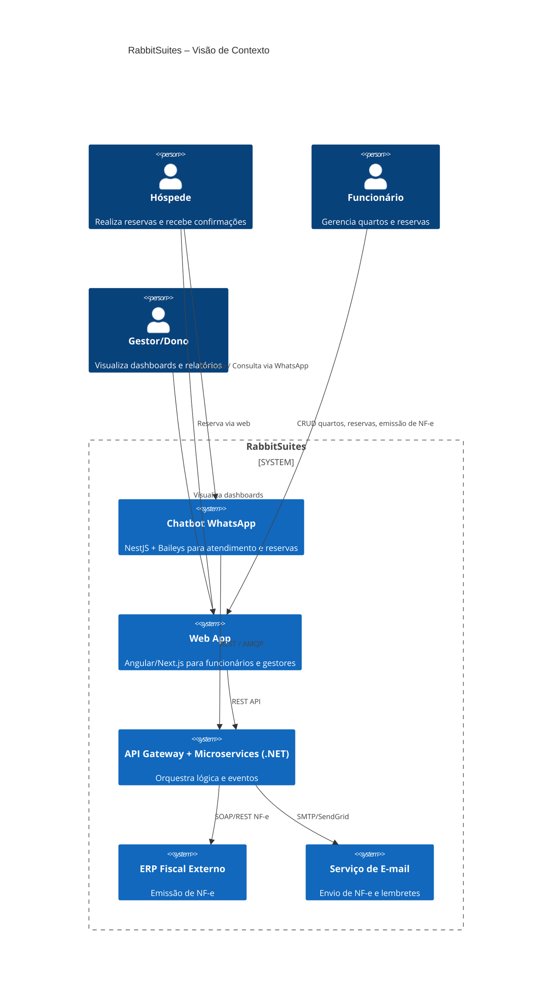
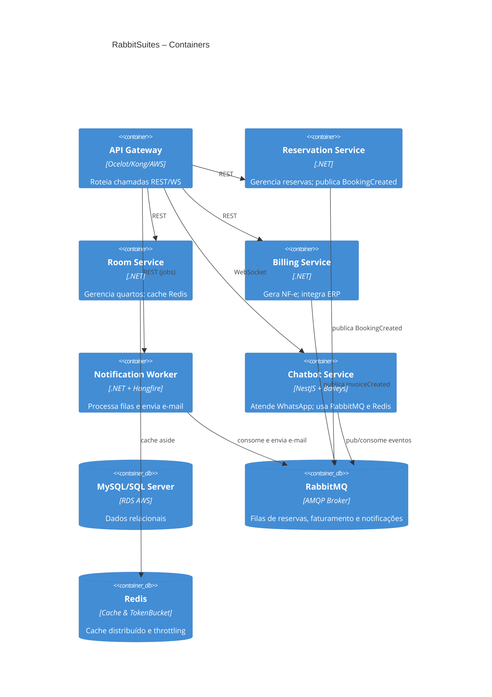

# 3. Especificação Técnica

### 3.1. Resumo
O **RabbitSuites** é uma plataforma multi‐serviço orientada a eventos, construída para orquestrar reservas, faturamento e notificações em hotéis. Cada microserviço segue DDD, expondo APIs REST/AMQP e publicando/consumindo eventos via RabbitMQ; o cache Redis e os mecanismos de resiliência (Token Bucket e Circuit Breaker) garantem performance e disponibilidade.

### 3.2. Componentes Principais do Sistema
1. **API Gateway**  
   - Roteia chamadas REST e WebSocket para os microserviços  
   - Aplica autenticação, autorização e throttling (Token Bucket)  

2. **Reservation Service (.NET)**  
   - Domínio “Reserva” (Aggregates, Entities, Domain Events)  
   - Persiste no MySQL via EF Core  
   - Publica `BookingCreated` em RabbitMQ  

3. **Room Service (.NET)**  
   - Domínio “Quarto” e “Disponibilidade”  
   - Cache Redis para consultas de disponibilidade  

4. **Billing Service (.NET)**  
   - Geração de NF-e e integração SOAP/REST com ERP fiscal  
   - Publica `InvoiceCreated` em RabbitMQ  

5. **Notification Worker (.NET + Hangfire)**  
   - Consome filas de eventos (`BookingCreated`, `InvoiceCreated`)  
   - Envia e-mails de confirmação, NF-e e lembrete de check-out  

6. **Chatbot Service (NestJS + Baileys)**  
   - Interface WhatsApp para reservas e alertas  
   - Publica comandos em RabbitMQ e consulta Redis para estado de diálogo  

7. **Infraestrutura de Mensageria e Cache**  
   - **RabbitMQ**: filas `reservas`, `faturamento`, `notificações`  
   - **Redis**: cache de dados quentes e Token Bucket distribuído  

### 3.3. Requisitos de Software

- **Requisitos Funcionais (RF)**  
  1. Orquestrar criação/consulta de reservas via RabbitMQ.  
  2. Gerar e-mails de NF-e e lembrete de check-out automaticamente.  
  3. Limitar taxa de requisições críticas (Token Bucket).  
  4. Isolar falhas em integrações externas (Circuit Breaker).  
  5. Cache Redis para aceleramento de dashboards.  
  6. Chatbot WhatsApp (Baileys) para reservas e alertas.  
  7. Área administrativa para gestão de quartos, reservas e relatórios.

- **Requisitos Não-Funcionais (RNF)**  
  - .NET e Node.js (NestJS) para serviços.  
  - MySQL ou SQL Server (RDS na AWS).  
  - RabbitMQ como broker AMQP.  
  - Redis para cache distribuído e throttling.  
  - Deploy em Docker/Kubernetes com CI/CD (GitHub Actions).  
  - Conformidade LGPD, TLS 1.2+, criptografia AES-256.

### 3.4. Considerações de Design

- Organização em microserviços DDD, desacoplados por filas e geridos via API Gateway.

### 3.5. Stack Tecnológica
- **Back-end:** .NET (C#), EF Core, Polly (Circuit Breaker)  
- **Chatbot:** NestJS + Baileys  
- **Broker:** RabbitMQ  
- **Cache & Throttle:** Redis  
- **Database:** MySQL/SQL Server  
- **Agendamento:** Hangfire ou cronexpression  
- **Infra & CI/CD:** Docker, Kubernetes, GitHub Actions, AWS, Vercel  

### 3.6. Considerações de Segurança
- Circuit Breaker + Retry + Timeout  
- Token Bucket distribuído  
- TLS 1.2+ e AES-256  
- Compliance LGPD  

---

## 3.7. Modelos C4

### 3.7.1. Diagrama de Contexto (C4 Nível 1)


### 3.7.2. Diagrama de Contêineres (C4 Nível 2)


### 3.7.3. Diagrama de Componentes (C4 Nível 3) – Reservation Service
```mermaid
C4Component
    title Reservation Service – Componentes Internos
    Container(reservationSvc, "Reservation Service", ".NET", "")
    Component(domain, "Domain Layer", "", "Entidades, ValueObjects, DomainServices, Eventos")
    Component(app, "Application Layer", "", "UseCases, Commands/Queries, DTOs, Interfaces")
    Component(infra, "Infrastructure Layer", "", "EF Core, RabbitMQ Publishers, Redis Client, TokenBucket")
    Component(api, "API Layer", "", "Controllers, Middlewares (CB, TB), DI")
    Rel(api, app, "Invoca UseCases")
    Rel(app, domain, "Aplica regras de negócio")
    Rel(app, infra, "Chama repositórios e publica eventos")
    Rel(infra, rabbit, "RabbitMQ Publisher")
    Rel(infra, redis, "TokenBucket + Cache")
```
